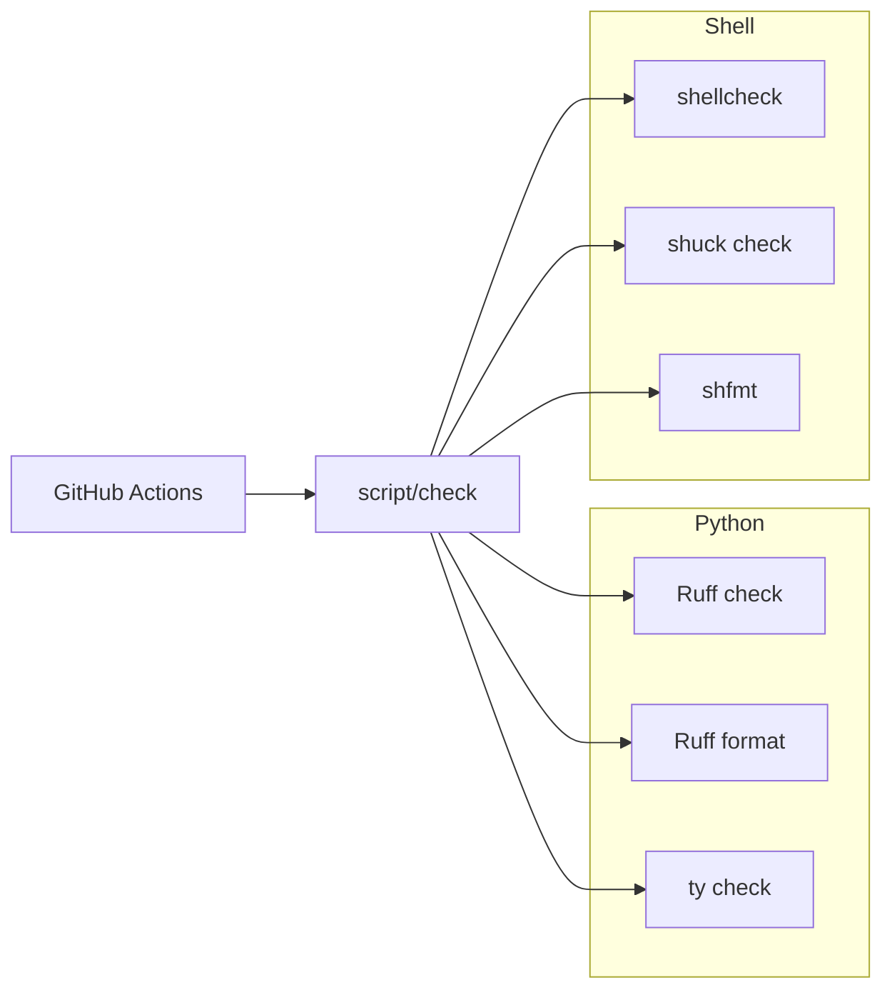

# Add type check, formatter, and lint

**Status: implemented** on `lint` (prep `7ab694d`; tooling tip; Setapp glob/sort on tip).

## Context

Tracked executable code is small:

| Path | Role |
|------|------|
| [`dodo.py`](../../dodo.py) | doit task definitions (typed, imports gitignored `myconfig`) |
| [`myconfig.example.py`](../../myconfig.example.py) | config schema template |
| [`has-doit.py`](../../has-doit.py) | doit import probe |
| [`script/setup`](../../script/setup) | bootstrap shell script |
| [`script/check`](../../script/check) | lint/format/typecheck runner |

Implemented: [`pyproject.toml`](../../pyproject.toml), [`requirements-dev.txt`](../../requirements-dev.txt), [`.github/workflows/check.yml`](../../.github/workflows/check.yml). Local ad hoc mypy left a `.mypy_cache/`; [`ports.txt`](../../ports.txt) may still list stale `py311-mypy` until regenerated by setup.

## Tool choices



- **Ruff** — lint + format (`E`, `F`, `I`, `UP`, `B`).
- **ty** — type checking (Astral; pairs with Ruff in `pyproject.toml`). Beta (`0.0.x`).
- **shellcheck** — lint [`script/setup`](../../script/setup) and [`script/check`](../../script/check) (`-s sh` and `-s dash`). See [Shell tool survey](#shell-tool-survey).
- **shuck** — additional shell lint (`shuck check`) on the same scripts plus [`.github/workflows/check.yml`](../../.github/workflows/check.yml) embedded `run:` blocks; pip package `shuck-cli`. Does **not** replace ShellCheck; `shuck format` still deferred (experimental).
- **shfmt** — format shell scripts (`-i 0` tabs, `-ci` case indent). See survey.

## Shell tool survey

Shell scripts are POSIX `#!/bin/sh`, tab-indented, no `.sh` extension — shellcheck and shfmt take explicit paths; shuck discovers via shebang when given paths. **decision: shellcheck + shuck check + shfmt** (`shuck format` still experimental). Dual ShellCheck dialects cover bashism checks; **checkbashisms** dropped (Ubuntu only via heavy `devscripts`).

<details>
<summary>Lint / format alternatives and shuck notes (unchanged reference)</summary>

### Lint alternatives

| Tool | Verdict |
|------|---------|
| **shellcheck** (chosen) | Keep |
| **shuck** | Additional `shuck check` (alongside ShellCheck); format still experimental |
| **bashate** | Reject — wrong dialect |
| **checkbashisms** | Dropped — Ubuntu only via heavy `devscripts`; dual ShellCheck covers it |
| **Shellens** | Reject — overkill |
| **`sh -n`** | Reject — syntax only |

### Format alternatives

| Tool | Verdict |
|------|---------|
| **shfmt** (chosen) | Keep |
| **shuck format** | Revisit (experimental; `SHUCK_EXPERIMENTAL=1`) |
| **beautysh** | Reject |

When `shuck format` is stable, reconsider replacing shfmt — not ShellCheck.

</details>

## What was implemented

### 1. [`pyproject.toml`](../../pyproject.toml)

```toml
[tool.ruff]
target-version = "py310"
line-length = 88
src = ["."]
extend-exclude = ["myconfig.py"]

[tool.ruff.lint]
select = ["E", "F", "I", "UP", "B"]

[tool.ruff.lint.per-file-ignores]
"dodo.py" = ["E402", "UP036"]
"myconfig.example.py" = ["E402", "UP036"]

[tool.ty.environment]
python-version = "3.10"

[tool.ty.src]
include = ["dodo.py", "myconfig.example.py", "has-doit.py"]

[tool.ty.analysis]
allowed-unresolved-imports = ["doit.**"]
```

- **E402 / UP036** per-file ignores — Python 3.10 guard before imports in `dodo.py` and `myconfig.example.py`.
- **ty** `include` lists tracked files only; `myconfig.py` excluded from Ruff.
- **`doit.**`** — `allowed-unresolved-imports` (no stubs).
- **Cleanup applied:** ruff format on all three Python files; `collections.abc` imports; `str | None` in `myconfig.example.py`; ty fix in `dodo.py` (`v` instead of `user["github"]` in narrowed branch). No ty rule overrides needed for `has-doit.py`.

### 2. [`requirements-dev.txt`](../../requirements-dev.txt)

```
ruff>=0.9
ty>=0.0.50
shuck-cli>=0.0.45
```

Shell system packages locally and in CI: `shellcheck`, `shfmt`. **shuck** comes from `requirements-dev.txt` (PyPI `shuck-cli`; Linux/macOS arm64 wheels — no macOS x86_64 wheel as of 0.0.45).

### 3. [`script/check`](../../script/check)

1. Require repo root (`pyproject.toml` and `script/check` in cwd); exit with cwd if not — no auto-`cd` / `CDPATH=` idiom.
2. Ensure `myconfig.py` exists so `dodo.py`’s `import myconfig` resolves under `ty check` — copy only when missing (fail loud on `cp` error; no `2>/dev/null || true`):
   ```sh
   if [ ! -e myconfig.py ]; then
   	cp myconfig.example.py myconfig.py
   fi
   ```
3. Require `ruff`, `ty`, `shuck`, `shellcheck`, `shfmt` (install hints; no auto-install). `ruff`/`ty`/`shuck` → `pip install -r requirements-dev.txt`; shell lint hint prefers MacPorts then Homebrew (`command -v`).
4. Run in order:
   - `ruff check .`
   - `ruff format --check .`
   - `ty check`
   - `shellcheck -s sh script/setup script/check` (POSIX)
   - `shellcheck -s dash script/setup script/check` (Debian/Ubuntu `/bin/sh`)
   - `shuck check script/setup script/check .github/workflows/check.yml`
   - `shfmt -d -i 0 -ci script/setup script/check`

### 4. [`.github/workflows/check.yml`](../../.github/workflows/check.yml)

- Trigger: `pull_request`, `push` to `master` only (`dev` lands via PR — no push check)
- Python **3.12**, `pip install -r requirements-dev.txt`
- `apt-get install shellcheck`
- **shfmt v3.10.0** pinned download — asset name must include the `v` prefix:
  `shfmt_${version}_linux_amd64` (not `${version#v}`; that 404s)
- `sh script/check` (from checkout root)

### 5. [`.gitignore`](../../.gitignore)

```
.ruff_cache/
.mypy_cache/
.ty_cache/
```

### 6. [`AGENTS.md`](../../AGENTS.md)

**Checks** under Commands: run from repo root with `sh script/check`; individual commands match `script/check` check modes (`ruff format --check`, `shfmt -d …`; apply via `ruff format .` / `shfmt -w …`); Shell bullet notes POSIX utility subset / non-GNU-only flags.

### 7. Shell cleanup ([`script/setup`](../../script/setup), [`script/check`](../../script/check))

- **shfmt** applied (`-i 0 -ci`) — redirect spacing, `case` indent in `script/check`.
- **shellcheck** — `-s sh` then `-s dash` in `script/check` (no global `-e`; no inline disables).
- **Setapp listing** — `*.app` glob loop + `${f##*/}`, then `LC_ALL=C sort -o` (no `ls`/`rg`; avoids SC2012 and non-POSIX `rg`).
- **shuck** — `shuck check` on `script/setup`, `script/check`, and `.github/workflows/check.yml` (alongside ShellCheck; does not replace it).
- **`script/check` root** — require cwd markers; no auto-`cd` / `CDPATH=` (tooling tip).
- **setup idioms** (`7ab694d`) — no SC3043/SC2091/SC2046: `"$1"` in `check_version`, `if uname | grep -q`, quoted `"$(check_version …)"`; `command -v` for `port`/`brew`/`mas`.

## Out of scope (unchanged)

- Ruby, Lua, pre-commit, pip lockfile.
- Adding ruff/ty/shellcheck/shfmt to [`Brewfile`](../../Brewfile) / MacPorts — optional follow-up; `script/check` missing-tool hint covers local install.
- Removing stale `py311-mypy` from [`ports.txt`](../../ports.txt) — regenerated by setup.

## Verification

```sh
# from repo root
sh script/check          # passes locally when tools installed
```

Confirm GitHub Actions **Check** workflow passes on PRs and on pushes to `master`.

## Implementation checklist

- [x] Add `pyproject.toml` with Ruff (exclude `myconfig.py`), ty config, per-file E402/UP036
- [x] Add `requirements-dev.txt` (ruff, ty, shuck-cli minimum versions)
- [x] Add `script/check` runner (myconfig bootstrap; ruff; ty; shellcheck; shuck; shfmt)
- [x] Run `ruff format --check`, `ty check`, `shfmt -d`; shellcheck/shuck/shfmt on `script/setup` and `script/check`
- [x] Add `.github/workflows/check.yml` (Python 3.12, pinned shfmt) calling `script/check`
- [x] Update `.gitignore` (`.ruff_cache`, `.mypy_cache`, `.ty_cache`) and AGENTS.md Checks section
- [x] CI shfmt asset URL, dual ShellCheck, repo-root guard, shuck — tooling tip
- [x] Python/setup ShellCheck cleanup — `7ab694d`
